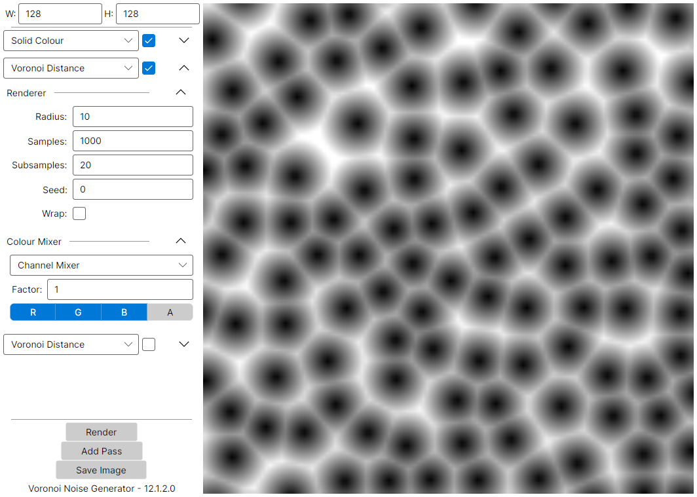

# Voronoi Noise Generator

Voronoi noise, also called Worley noise, is a type of procedural noise generated by outputting the distance to the nearest feature point in a grid of randomly placed "features", referred to in this application as "samples".
It is commonly used in computer graphics for texture generation.

This applications allows you to generate and mix different variants of Voronoi noise, and export the result.
Features are generated uniformly using Poisson disc sampling.

  

This is a work in progress. 
I plan to improve the UI to look less cluttered, and add more features.

## Types of Noise
This applications supports three types:
- **Distance**: The distance to the nearest sample.
- **Cell**: The index of the nearest sample.
- **Edge**: The distance to the nearest edge between samples.

---

I wrote a similar application, [Voronoi Generator](https://github.com/erikhurinek/VoronoiGenerator), a few years ago.
This app aims to implement a more flexible architecture, follow better code practices, and use a cross-platform UI framework (Avalonia).