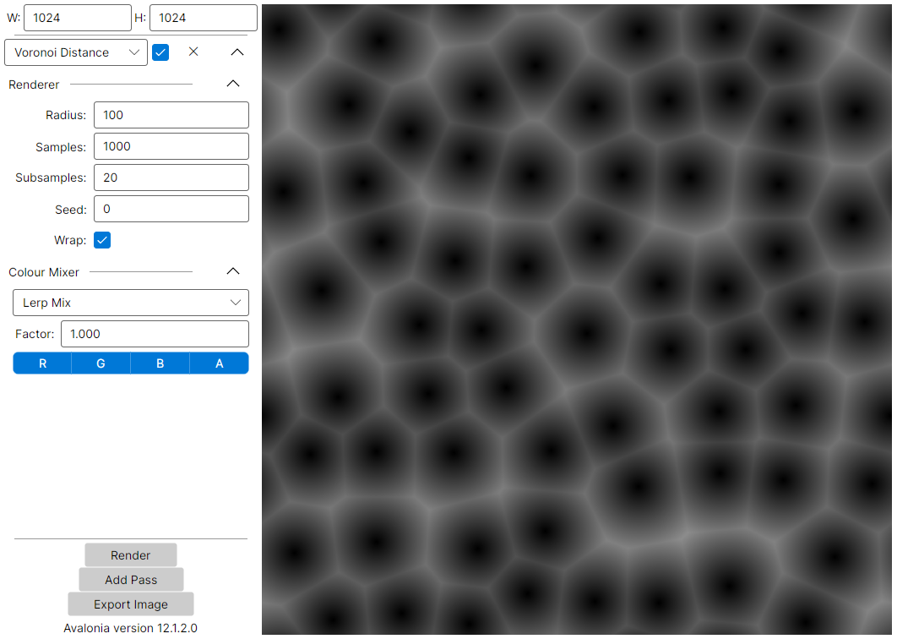

# Voronoi Noise Generator

Voronoi noise, also called Worley noise, is a type of procedural noise generated by outputting the distance to the nearest randomly-place feature point.
It is commonly used in computer graphics for texture generation.

This Avalonia application allows you to generate and mix different variants of Voronoi noise.
Features are generated with uniform positions using Poisson disc sampling.

<p align="center">
  <picture>
    <source media="(prefers-color-scheme: dark)" srcset="./.github/media/screenshot-dark.png">
    
  </picture>
</p>

This is a work in progress. 
I plan to improve the UI to look less cluttered and add more features.

## Types of Noise
This applications supports four types:
- **Distance**: The distance to the nearest sample.
- **Cell**: The index of the nearest sample.
- **Edge**: The distance to the nearest edge between samples.
- **Position**: The position of the nearest sample, remapped from [-1,2] to [0,1].

## Building and Running

Note that only Linux has been tested.

### Prerequisites 
 - [.NET 10 SDK](https://dotnet.microsoft.com/download/dotnet/10.0)
 - Git

### Run From Source
Clone the repository and run:

```bash
git clone https://github.com/erikhurinek/VoronoiNoiseGenerator.git
cd VoronoiNoiseGenerator

dotnet restore
dotnet run
```

---

I wrote a similar application, [Voronoi Generator](https://github.com/erikhurinek/VoronoiGenerator), a few years ago.
This app aims to implement a more flexible architecture, follow better code practices, and use a cross-platform UI framework.
